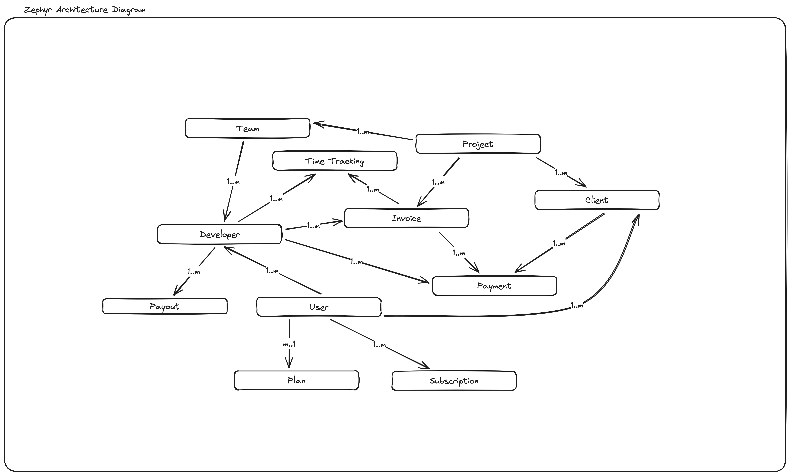

# Zephyr

### All-in-one Tool for Remote Developers

Zephyr is an open-source time-tracking, invoice-management, and payment solution for remote developers. People worldwide can easily track their time and get paid while working remotely from their clients.

## Stack used

- **Frontend**: Next.js
- **Backend**: SST
- **Database**: AWS DynamoDB
- **Auth**: Google, Magic Link
- **API**: GraphQL
- **Payment**: Stripe, Paypal
- **Style**: Tailwind, ShadCN UI

## Architecture Decisions

